# Backtesting Engine Comparison: `backtestgosqlite` vs. `Backtrader`

This document provides a comprehensive technical comparison between the backtesting engine implemented in [`backtestgosqlite`](file:///Users/darianhickman/Documents/backtestgosqlite) and the industry-standard [Backtrader](https://www.backtrader.com/) framework. It also outlines actionable recommendations and architectural upgrades to make `backtestgosqlite`'s backtesting capabilities substantially more powerful, realistic, and production-grade.

---

## 1. Executive Summary

| Dimension | `backtestgosqlite` (Current) | `Backtrader` |
| :--- | :--- | :--- |
| **Primary Architecture** | **Vectorized SQL Pipeline (SQLite / Go)** | **Hybrid Event-Driven & Vectorized (Python)** |
| **Execution Model** | Batch relational queries, window functions, and cross-joins over historical price tables. | Bar-by-bar event loop (`Cerebro`) simulating live broker state transitions. |
| **Core Strength** | **Massive universe screening speed** across hundreds/thousands of symbols; direct SQL-to-database live integration. | **Deep execution realism**, portfolio cash/margin accounting, rich order types, risk analytics, and visual plotting. |
| **Universe Handling** | Native multi-asset batch processing via `GROUP BY symbol` and indexed joins. | Iterates over feeds; requires handling multiple data streams in memory. |
| **Portfolio & Cash Tracking** | ❌ **None** (treats every signal as an independent isolated event). |  **Complete** (cash balance, margin, leverage, equity curve, portfolio allocation). |
| **Slippage & Commission** | ❌ **None** (assumes exact fill prices, zero slippage, zero transaction costs). |  **Full** (custom commission schemes, spread, fixed/variable slippage, volume fill limits). |
| **Order Types** | Basic Next-Day Limit Entry + Target High Exit. | Market, Limit, Stop, StopLimit, StopTrail, OCO, Bracket, MOC, Target Orders. |
| **Performance Analytics** | Win rate count (`win20_10d_rate`), avg/max gain metrics. | Sharpe, Sortino, Max Drawdown, Calmar, SQN, VWR, PyFolio integration. |
| **Strategy & Live Parity** | SQL scripts + GAE Go crons calling Alpaca SDK. | Unified `Strategy` class used identically for backtest and live execution. |

---

## 2. In-Depth Architectural Comparison

```mermaid
flowchart TD
    subgraph WC2022["backtestgosqlite Architecture (Vectorized Relational)"]
        A1[Historical Data MarketData/Alpaca] --> A2[(wc_master_backtest.db)]
        A2 --> A3[25-Stage SQL Pipeline\n- MinLow Slices\n- Buy Signals\n- Entry/Exit Slices\n- Win20_10d]
        A3 --> A4[wc_summary\nfilter_90pct_symbols.sql]
        A4 --> A5[(settings.db: backtested_win_20_10d)]
        A5 --> A6[Daily GAE Cron Live Scanner / Alpaca Order Dispatch]
    end

    subgraph BacktraderArch["Backtrader Architecture (Event-Driven Broker)"]
        B1[Data Feeds CSV/Pandas/Live] --> B2[Cerebro Engine]
        B2 --> B3[Strategy Next Event Loop]
        B3 --> B4[Simulated Broker & Sizer\n- Cash Ledger & Margin\n- Slippage & Commissions\n- Order Book & Fills]
        B4 --> B5[Analyzers & Observers\n- Sharpe, Drawdown, Equity]
        B5 --> B6[Matplotlib Plotting & PyFolio Tear Sheets]
    end
```



### 2.1 Philosophy & Execution Paradigms

#### `backtestgosqlite`: Declarative Relational Vectorization
* **How it works**: The backtest operates as a sequence of 25 SQL scripts ([`sql/`](file:///Users/darianhickman/Documents/backtestgosqlite/sql)) orchestrated by Go ([`cmd/backtest/main.go`](file:///Users/darianhickman/Documents/backtestgosqlite/cmd/backtest/main.go)). It computes lookback windows (e.g. [`wc_calc_trailing_minlow.sql`](file:///Users/darianhickman/Documents/backtestgosqlite/sql/wc_calc_trailing_minlow.sql)), entry feasibility ([`calc_wc_entry_slice.sql`](file:///Users/darianhickman/Documents/backtestgosqlite/sql/calc_wc_entry_slice.sql)), and forward lookahead outcomes ([`calc_win20_10d.sql`](file:///Users/darianhickman/Documents/backtestgosqlite/sql/calc_win20_10d.sql)) across all symbols at once.
* **Benefits**: 
  - Extremely fast execution across large universes (leveraged ETFs, momentum equities).
  - Simple database-driven querying for statistical discovery (e.g., finding all symbols with $\ge 90\%$ win rate over $\ge 5$ triggers).
  - Decoupled from application runtime overhead.
* **Weaknesses**:
  - Does not model chronological order collisions or portfolio capital bottlenecks (e.g., if 10 signals fire on Monday but available capital only supports 3 positions).
  - Incapable of complex stateful logic (dynamic trailing stops modified bar-by-bar, scale-ins, adaptive profit targets based on market regime).

#### `Backtrader`: Event-Driven Broker Simulation
* **How it works**: Data bars are dispatched chronologically tick-by-tick or bar-by-bar into an event engine (`Cerebro`). Indicators are vectorized where possible, but strategy logic and broker operations execute sequentially inside `next()` handlers.
* **Benefits**:
  - True-to-life market simulation: orders submitted on bar $T$ cannot fill until bar $T+1$ (or subject to specific cheat-on-open flags).
  - Exact simulation of available cash, portfolio margin, leverage, dividends, and borrow costs.
  - Pluggable sizers, commission schemas, and complex execution logic (e.g. OCO and trailing stops).
* **Weaknesses**:
  - Can be slower when running massive parameter sweeps across thousands of symbols without parallel worker orchestration.
  - Higher code complexity for simple statistical universe filtering compared to a concise SQL `GROUP BY`.

---

## 3. Feature-by-Feature Matrix

| Capability Area | Feature | `backtestgosqlite` | `Backtrader` | Analysis & Impact |
| :--- | :--- | :---: | :---: | :--- |
| **Data Handling** | Multi-Asset Universe |  Native |  Feed-based | `backtestgosqlite` handles hundreds of symbols in one SQLite table seamlessly. |
| | Mixed Timeframes | ❌ |  Supported | Backtrader can mix 5m, 1h, and 1D bars in a single strategy. |
| | Data Resampling & Replay | ❌ |  Built-in | Backtrader can resample ticks/minutes to daily bars dynamically. |
| **Order Management** | Order Types | Next-day Limit | Market, Limit, Stop, StopLimit, StopTrail, Bracket, OCO, MOC | `backtestgosqlite` only supports limit buying and static price targets. |
| | Volume Fill Limits | ❌ |  Supported | Backtrader can restrict fills to a maximum percentage of bar volume. |
| | Slippage Simulation | ❌ |  Supported | Backtrader allows fixed, percentage, and spread-based slippage. |
| | Commissions & Fees | ❌ |  Supported | Backtrader supports per-share, per-order, percentage, and exchange fees. |
| **Portfolio & Risk** | Account Cash Ledger | ❌ |  Built-in | `backtestgosqlite` has no concept of remaining account cash or overall portfolio equity. |
| | Concurrent Position Cap | ❌ |  Built-in | `backtestgosqlite` cannot limit max open concurrent trades across the universe. |
| | Dynamic Position Sizing | Hardcoded `$2000` | Sizers (Fixed, % Equity, ATR, Kelly) | Backtrader supports dynamic volatility-adjusted and risk-parity sizing. |
| | Short Selling & Margins | ❌ |  Built-in | Backtrader handles short borrowing costs, margin maintenance, and margin calls. |
| **Analytics & Reporting** | Win/Loss & Gain Metrics |  Basic |  Comprehensive | `backtestgosqlite` calculates win rate and max gain; Backtrader breaks down trades completely. |
| | Risk-Adjusted Returns | ❌ |  Built-in | Sharpe, Sortino, Calmar, SQN, Omega ratios. |
| | Drawdown Analysis | ❌ |  Built-in | Max Drawdown (MDD), drawdown durations, recovery periods. |
| | Visual Trade Plotting | ❌ (CLI table) |  Matplotlib / Bokeh | Backtrader generates complete visual candlestick charts with buy/sell markers. |
| **Optimization** | Parameter Grid Search | ❌ (Manual) |  Built-in (Multi-core) | Backtrader optimizes parameter ranges using Python multiprocessing. |
| | Out-of-Sample / Walk-Forward | ❌ |  Custom / Extensible | Essential to protect against curve-fitting and data snooping. |

---

## 4. Strengths of `backtestgosqlite` (Where it Excels)

1. **Lightning-Fast Universe Screening**:
   Using SQLite table indices and window functions ([`sql/gen_idx.sql`](file:///Users/darianhickman/Documents/backtestgosqlite/sql/gen_idx.sql)), `backtestgosqlite` evaluates thousands of ticker days in seconds without loading massive object hierarchies in Python.
2. **Clean Separation of Concerns**:
   The 25-stage pipeline breaks down technical patterns into discrete, readable tables (`wc_trailing_minlow_slice`, `wc_buy_signal_slice`, `win20_10d_slice`), making pipeline stages debuggable with standard SQL tools.
3. **Direct Integration with Deployment State**:
   The output of [`filter_90pct_symbols.sql`](file:///Users/darianhickman/Documents/backtestgosqlite/sql/filter_90pct_symbols.sql) directly populates `backtested_win_20_10d` in [`settings.db`](file:///Users/darianhickman/Documents/backtestgosqlite/settings.db), which immediately gates live scanner decisions ([`gae/go/Entries.go`](file:///Users/darianhickman/Documents/backtestgosqlite/gae/go/Entries.go)).

---

## 5. Critical Deficiencies in `backtestgosqlite` Backtesting

1. **Lookahead & Collision Blindness (Independent Trade Fallacy)**:
   `backtestgosqlite` evaluates every signal as if the trader had unlimited cash to take every single trade that fired. If 15 leveraged ETFs trigger buy signals on the same day, `backtestgosqlite` counts all 15 in the win rate, whereas a real $25,000 account might only be able to enter 2 or 3.
2. **Absence of a Stop-Loss Engine**:
   `calc_win20_10d.sql` checks if price reached $+20\%$ at *any point* in the next 10 days (`h.maxhigh10 > b.Close * 1.20`). However, if the stock dropped $-40\%$ on Day 2 before bouncing on Day 9, in real trading the position would have suffered catastrophic drawdown or stop-out, but `backtestgosqlite` marks it as a $100\%$ win.
3. **No Portfolio Equity Curve or Drawdown Metrics**:
   A strategy with a $90\%$ win rate can still go bankrupt if the $10\%$ losses are $-50\%$ drops. Without Max Drawdown, Sharpe Ratio, and equity curve tracking, statistical confidence is incomplete.
4. **Hardcoded Sizing & Fill Realism**:
   Position sizing is fixed at `$2000 / close` without considering liquidity (volume), spread, or slippage.

---

## 6. Actionable Roadmap: What Features to Add to `backtestgosqlite`

To elevate `backtestgosqlite`'s backtesting engine into a robust, institutional-grade system while preserving its fast SQL foundations, implement the following roadmap:

### Phase 1: Portfolio Simulator & Capital Ledger (High Priority)
* **Goal**: Bridge the gap between isolated signal win rates and true portfolio returns.
* **Implementation**:
  - Add a Go simulation module ([`cmd/backtest/simulator.go`](file:///Users/darianhickman/Documents/backtestgosqlite/cmd/backtest)) that iterates chronologically over generated entry signals.
  - Maintain an **Account State** struct: `StartingCapital`, `AvailableCash`, `OpenPositions`, `RealizedPnL`, `UnrealizedPnL`.
  - Enforce constraints:
    - Max Concurrent Positions (e.g. max 5 positions, 20% allocation each).
    - Signal Prioritization: When signals exceed available cash, rank candidates by `win20_10d_rate` or lowest volatility.

```go
// Proposed Simulator Architecture for backtestgosqlite
type PortfolioSimulator struct {
    InitialCapital   float64
    Cash             float64
    MaxPositions     int
    Positions        map[string]*Position
    EquityCurve      []DailyEquityPoint
    ClosedTrades     []TradeRecord
}
```

### Phase 2: Stop-Loss & Intraday Adverse Excursion (CRITICAL for Survival)
* **Goal**: Prevent false positives where a trade suffers huge drawdown before hitting profit targets.
* **Implementation**:
  - Create `minlow10_slice` (similar to [`maxhigh10_slice`](file:///Users/darianhickman/Documents/backtestgosqlite/sql/maxhigh10_slice_schema.sql)).
  - Implement **Path Dependency / Barrier Checking**:
    - If `StopLossPrice` (e.g., $-7\%$ or trailing min low) is hit **before or on the same day** as the $+20\%$ profit target, record the trade as a **Loss**.
    - Calculate **Maximum Adverse Excursion (MAE)** and **Maximum Favorable Excursion (MFE)** per trade.

### Phase 3: Realistic Execution Model (Slippage, Fees & Liquidity Limits)
* **Goal**: Ensure backtested alpha survives live market friction.
* **Implementation**:
  - **Slippage Model**: Deduct a configurable spread/slippage buffer (e.g. 0.05% - 0.15% per trade, higher on leveraged ETFs).
  - **Volume Participation Cap**: Reject or scale down entries where order size exceeds $1\%$ of the 20-day Average Daily Volume (ADV).
  - **Fee Calculation**: Deduct Alpaca/regulatory exchange fees ($0.000166 per share FINRA, etc.) to accurately track net yield.

### Phase 4: Risk Analytics & Tear Sheet Generation
* **Goal**: Provide standard quant performance metrics.
* **Implementation**:
  - Compute:
    - **CAGR** (Compound Annual Growth Rate)
    - **Sharpe & Sortino Ratios** (risk-free adjusted return volatility)
    - **Max Drawdown (MDD) & Max Drawdown Duration**
    - **Profit Factor** ($\frac{\text{Total Gross Profit}}{\text{Total Gross Loss}}$)
    - **Win/Loss Payoff Ratio** ($\frac{\text{Average Win \$}}{\text{Average Loss \$}}$)
  - Generate an automated Markdown/HTML summary report after every run of [`backtest_all.sh`](file:///Users/darianhickman/Documents/backtestgosqlite/backtest_all.sh).

### Phase 5: Automated Parameter Optimization & Walk-Forward Validation
* **Goal**: Systematically discover optimal parameters without overfitting.
* **Implementation**:
  - Add CLI flags in `cmd/backtest` to sweep parameter grids:
    - Cliff drop ratio: `0.85`, `0.88`, `0.90`, `0.92`, `0.95`
    - Trailing low lookback window: `5`, `8`, `10`, `12`, `15` days
    - Target gain threshold: `10%`, `15%`, `20%`
    - Max holding days: `5`, `10`, `15`, `20` days
  - Implement **Walk-Forward In-Sample / Out-of-Sample Splitting**:
    - Train / optimize on Years 1–3 ($2020-2023$).
    - Test / validate on Year 4 ($2023-2024$).

### Phase 6: Visual Web Dashboard
* **Goal**: Replace ASCII terminal tables with visual equity curves and trade overlays.
* **Implementation**:
  - Extend [`web/index.html`](file:///Users/darianhickman/Documents/backtestgosqlite/web/index.html) or [`cmd/ui`](file:///Users/darianhickman/Documents/backtestgosqlite/cmd/ui) to render interactive Chart.js / Plotly dashboards showing:
    - Cumulative Portfolio Value vs. SPY Benchmark.
    - Underwater Drawdown Chart.
    - Candlestick plots with entry price, stop-loss line, and target exit points.

---

## 7. Recommended Hybrid Architecture

Rather than completely rewriting `backtestgosqlite` in Python/Backtrader (which would lose the high-speed SQL universe scanning advantages), adopt a **Two-Tier Hybrid Pipeline**:

```
┌─────────────────────────────────────────────────────────────────────────────┐
│ TIER 1: SQL High-Speed Universe Scanner (SQLite / Go)                       │
│ - Scans 5,000+ symbols across 4+ years of data in seconds.                  │
│ - Filters for high-confidence pattern triggers (e.g. 90% confidence pool). │
└──────────────────────────────────────┬──────────────────────────────────────┘
                                       │ Raw Triggers & Slices
                                       ▼
┌─────────────────────────────────────────────────────────────────────────────┐
│ TIER 2: Portfolio Ledger & Risk Engine (Go / Backtrader Bridge)             │
│ - Chronological order matching against finite cash.                         │
│ - Dual-barrier stop-loss / profit target checks (MAE / MFE).                │
│ - Slippage, commissions, and position sizer.                                │
│ - Equity curve, Sharpe ratio, and Max Drawdown calculation.                 │
└──────────────────────────────────────┬──────────────────────────────────────┘
                                       │ Verified Portfolio Parameters
                                       ▼
┌─────────────────────────────────────────────────────────────────────────────┐
│ TIER 3: Live GAE / Alpaca Deployment                                        │
│ - Exact strategy parameters deployed directly to Alpaca API.                │
└─────────────────────────────────────────────────────────────────────────────┘
```

This hybrid approach gives you the **speed of SQL for universe screening** and the **rigor of Backtrader-style event simulation for portfolio risk and cash management**.
